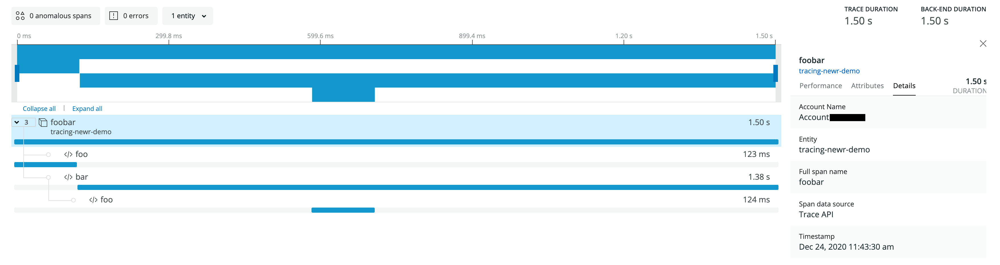

# tracing-newrelic

[New Relic] integration for tracing

# Overview

This crate provides a layer for collecting trace data from `tracing` and repoters for sending them to [New Relic].

# Examples

```rust
use std::thread::sleep;
use std::time::Duration;

use tracing_newrelic::{NewRelicLayer, BlockingReporter};
use tracing_subscriber::layer::SubscriberExt;

#[tracing::instrument]
fn foo(_: u32) {
    sleep(Duration::from_millis(123));
}

#[tracing::instrument]
fn bar(a: u32) {
    sleep(Duration::from_millis(456));
    foo(a);
    sleep(Duration::from_millis(789));
}

#[tracing::instrument(fields(service.name = "tracing-newr-demo"))]
fn foobar() {
    foo(1);
    bar(2);
}

fn main() {
    let layer = NewRelicLayer::new(BlockingReporter::new(
        "XXXX-XXXXXXXX-XXXXXXXXXXXXXXXXXXXXXXX",
    ));

    let subscriber = tracing_subscriber::Registry::default().with(layer);

    tracing::subscriber::with_default(subscriber, foobar);
}
```

1. Replace `XXXX-XXXXXXXX-XXXXXXXXXXXXXXXXXXXXXXX` above with your api key and run it.

2. Open [New Relic One], navigate to `Entity explorer` and search for `tracing-newr-demo`.

3. You should see a entry span named `foobar` and click it for more details:



[New Relic]: https://newrelic.com/
[New Relic One]: http://one.newrelic.com/